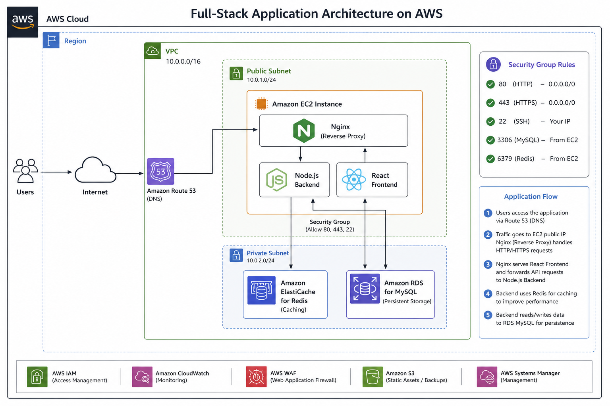

# AWS Full-Stack Application on AWS

A production-style full-stack web application deployed on AWS using React.js, Node.js, Nginx, Amazon ElastiCache (Redis), and Amazon RDS MySQL.

## Architecture

## Project Overview

This project demonstrates how to deploy a scalable full-stack application on AWS.

The application uses:

- React.js for the frontend
- Node.js and Express.js for the backend API
- Nginx as a reverse proxy
- Amazon ElastiCache (Redis) for caching
- Amazon RDS MySQL for persistent storage
- Amazon Route 53 for DNS routing

## Architecture Flow

User
↓
Route 53
↓
Nginx
↓
React Frontend
↓
Node.js Backend
↓
Redis Cache
↓
RDS MySQL

## AWS Services Used

- Amazon EC2
- Amazon Route 53
- Amazon RDS MySQL
- Amazon ElastiCache Redis
- Amazon VPC
- Security Groups
- AWS IAM
- Amazon CloudWatch
- AWS WAF
- Amazon S3
- AWS Systems Manager

## Features

- Full-stack application deployment
- React frontend hosting
- Node.js REST API
- Redis caching layer
- MySQL database integration
- Nginx reverse proxy
- Route 53 DNS routing
- AWS cloud deployment

## Tech Stack

### Frontend
- React.js
- Axios

### Backend
- Node.js
- Express.js

### Database
- Amazon RDS MySQL

### Cache
- Amazon ElastiCache Redis

### Web Server
- Nginx

### Cloud
- AWS

## Project Structure

aws-full-stack-app/
├── README.md
├── architecture.png
├── frontend/
├── backend/
├── database/
└── nginx/

## Application Flow

1. User accesses the application through Route 53.
2. Nginx receives incoming requests.
3. React frontend is served to users.
4. API requests are forwarded to Node.js.
5. Node.js checks Redis cache.
6. On cache miss, data is fetched from MySQL.
7. Results are cached in Redis.
8. Response is returned to the frontend.

## Future Improvements

- HTTPS using SSL/TLS
- CI/CD with GitHub Actions
- Infrastructure as Code using Terraform
- Load Balancer integration
- Auto Scaling

## Author

Vikas Jagtap